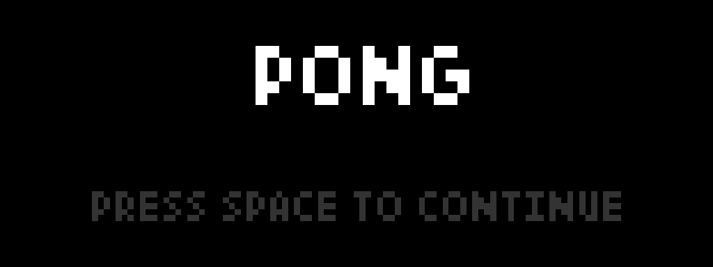
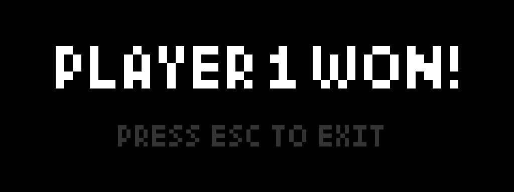
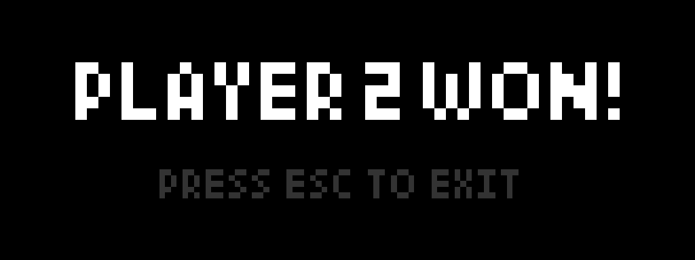

# PongGraphics

## Gameplay

### Main menu

### Game process

### Result

## Compilation

### Windows
You can compile the game with ./compile.bat or with use Visual Studio 2022. To compile the game with compile.bat you should have CMake and GCC compiler.

### Linux
You can compile the game with ./compile.sh script. To compile the game you should install dependencies with ./install-dependencies.sh script.
